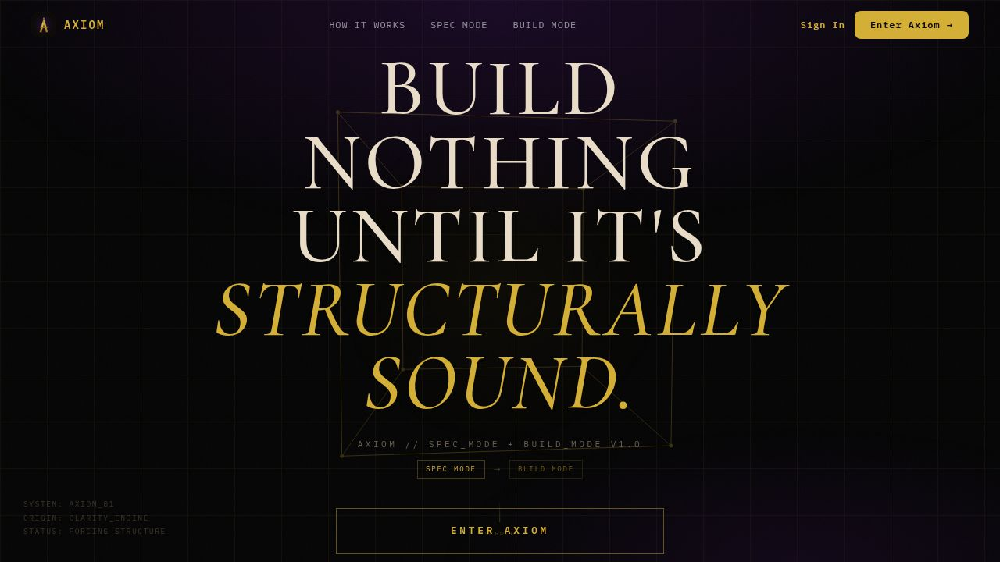

# Axiom

**Strategic Thinking Partner for Founders & Builders..**

Axiom is not a general-purpose AI chat tool. It is a system built around a single idea: the decisions you make under pressure are the ones you'll regret. Axiom shows up when you're about to contradict something you already committed to, and makes you explain yourself first.

**Live:** [axiomsystem.app](https://axiomsystem.app) &nbsp;·&nbsp; 



---

## What It Does

### Decision Catch Engine
The core of Axiom. When you say something that conflicts with a prior committed decision, Axiom fires a structured catch card — it shows what you said, what you committed to, and asks you to either explain the deviation or adjust course. Every deviation is logged to the ledger.

### Decision Ledger
A permanent record of every commitment you make, organized by project. Entries are tagged as committed, in-tension, or overridden. The ledger is the audit trail of your thinking.

### Session Memory
Three layers of persistent memory so Axiom never loses context:
- **Project Memory** — facts Atlas learns during sessions, stored in the database, injected at the start of every conversation
- **User Profile** — your stack, preferences, and working context
- **AI Memory Protocol** — the AI emits structured memory facts that are auto-stripped from visible output and persisted

### System Map
A visual architecture map of your project's six core layers (Auth, Database, API Routes, State Management, UI Components, Business Logic). Mark nodes resolved as you define each layer. Readiness score updates in real time.

### Parking Lot
Ideas that aren't decisions yet. Park them with one tap. Resume, commit, or discard later.

### GitHub Integration
Link a repository to a project. Browse the file tree, load file context into chat, and (coming in Phase 2) push diffs directly from the workspace.

---

## Current Status

| Feature | Status |
|---|---|
| Decision Catch Engine | ✅ Live |
| Decision Ledger | ✅ Live |
| Session Memory (3-layer) | ✅ Live |
| System Map | ✅ Live |
| Parking Lot | ✅ Live |
| GitHub file browser + context | ✅ Live |
| Auth (email + Google OAuth) | ✅ Live |
| Stripe billing (Free / Pro) | ✅ Live |
| GitHub write-back (diff → PR) | 🔜 Phase 2 |
| Route / component mapping | 🔜 Phase 3 |
| Live app preview in iframe | 🔜 Phase 4 |

---

## Stack

| Layer | Technology |
|---|---|
| Frontend | React 19 + Vite 7 |
| Backend | Express 5 |
| Database | PostgreSQL via Drizzle ORM |
| AI | Claude (claude-sonnet-4-5) via Anthropic |
| Auth | Email/password + Google OAuth |
| Payments | Stripe |
| API contract | OpenAPI 3.1 + Orval codegen |
| Deployment | Replit |

---

## Local Setup

Agents should run `bash setup.sh` before any task to install missing dependencies and run the library typecheck.

### Prerequisites
- Node.js 20+
- pnpm 9+
- PostgreSQL database (or use Replit's built-in)

### 1. Clone and install

```bash
git clone <repo-url>
cd axiom
pnpm install
```

### 2. Environment variables

Copy `.env.example` to `.env` and fill in the required values:

```bash
cp .env.example .env
```

| Variable | Required | Description |
|---|---|---|
| `DATABASE_URL` | ✅ | PostgreSQL connection string |
| `ANTHROPIC_API_KEY` | ✅ | Claude API key for AI chat |
| `SESSION_SECRET` | ✅ | Secret for session signing (any random string) |
| `GOOGLE_CLIENT_ID` | Optional | For Google OAuth login |
| `GOOGLE_CLIENT_SECRET` | Optional | For Google OAuth login |
| `STRIPE_SECRET_KEY` | Optional | For billing features |
| `STRIPE_PUBLISHABLE_KEY` | Optional | For billing features |
| `STRIPE_WEBHOOK_SECRET` | Optional | For Stripe webhook verification |

### 3. Push the database schema

```bash
pnpm --filter @workspace/db run push
```

### 4. Run the development servers

The project uses two services:

```bash
# Terminal 1 — API server (port 8080, serves /api)
pnpm --filter @workspace/api-server run dev

# Terminal 2 — Frontend (port varies, serves /)
pnpm --filter @workspace/atlas run dev
```

On Replit, both run automatically via configured workflows.

### 5. Open the app

Navigate to `http://localhost:80` (via the Replit proxy) or the port your Vite dev server reports.

---

## Project Structure

```
axiom/
├── artifacts/
│   ├── atlas/              React + Vite frontend
│   │   └── src/
│   │       ├── pages/      Route-level components
│   │       ├── components/ Shared UI components
│   │       └── hooks/      Custom React hooks
│   └── api-server/         Express 5 API server
│       └── src/
│           ├── routes/     API route handlers
│           └── index.ts    Server entry point
├── lib/
│   ├── db/                 Drizzle ORM schema + migrations
│   ├── api-spec/           OpenAPI spec (source of truth)
│   ├── api-client-react/   Generated React Query hooks
│   └── api-zod/            Generated Zod schemas
└── scripts/                Utility scripts
```

### API Contract

The API contract lives in `lib/api-spec/openapi.yaml`. After any spec change, regenerate client code:

```bash
pnpm --filter @workspace/api-spec run codegen
```

Never edit files in `lib/api-client-react/` or `lib/api-zod/` directly — they are generated.

---

## Useful Commands

```bash
# Typecheck the frontend
pnpm --filter @workspace/atlas run typecheck

# Typecheck the API server (via build)
pnpm --filter @workspace/api-server run build

# Full typecheck (libs + all packages)
pnpm run typecheck

# Regenerate API client after spec changes
pnpm --filter @workspace/api-spec run codegen

# Push schema changes to the database
pnpm --filter @workspace/db run push
```

---

## Roadmap

**Phase 1 — Connect + Read** *(~70% complete)*
- [x] GitHub repository browser
- [x] File tree navigation
- [x] File context loading into chat
- [ ] Auto-link repos per project without manual setup

**Phase 2 — Apply Edits** *(not started)*
- [ ] Diff generation from AI suggestions
- [ ] GitHub write-back (create commit or PR from workspace)

**Phase 3 — Understand** *(not started)*
- [ ] Route / component / table auto-mapping
- [ ] Auto-generated project overview from codebase scan

**Phase 4 — Live Preview** *(not started)*
- [ ] Running app preview in iframe (not just a typed URL)

---

## Design System

Two themes: **Obsidian** (default dark) and **Parchment** (warm light). Toggle via the avatar menu.

Core identity tokens:
```css
--atlas-bg:      #0C0A09   /* True obsidian */
--atlas-surface: #1C1917   /* Raised panels */
--atlas-fg:      #E7E5E4   /* Primary text */
--atlas-gold:    #C9A24C   /* Accent — ledger, labels */
--atlas-ember:   #92400E   /* Decision Catch, send button */
```

Typography: Geist (sans) + Geist Mono (labels, timestamps, mode indicators).

---

## Contributing

See [CONTRIBUTING.md](./CONTRIBUTING.md).

---

## License

MIT — see [LICENSE](./LICENSE).
